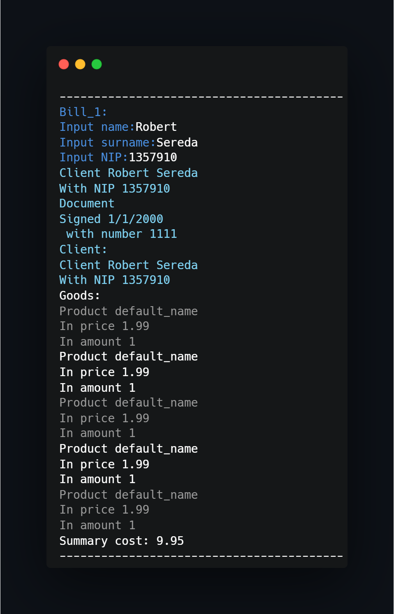

## What project do?
___

Project shows union implemetation between classes:

 - generalization-specialization
 - asociation
 - agregation  

~~~~
Document:
    -> Bill
        -> [field] Product
        -> [field] Client
    -> [field] Date
~~~~

### Program execution:

## How to use?
___
Just import project to CodeBlocks and compile/run.

<!--https://banner.godori.dev/-->
<!--https://shields.io/-->
<!--https://carbon.now.sh/-->